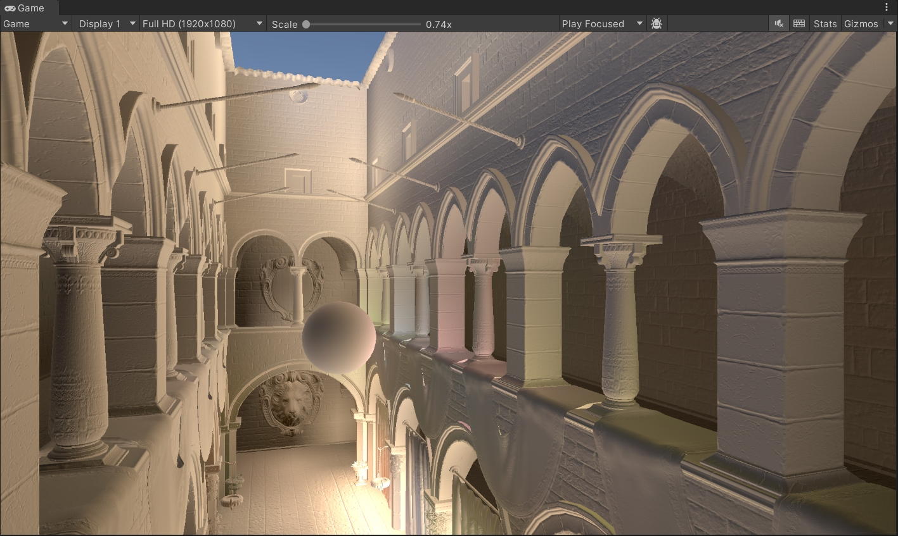
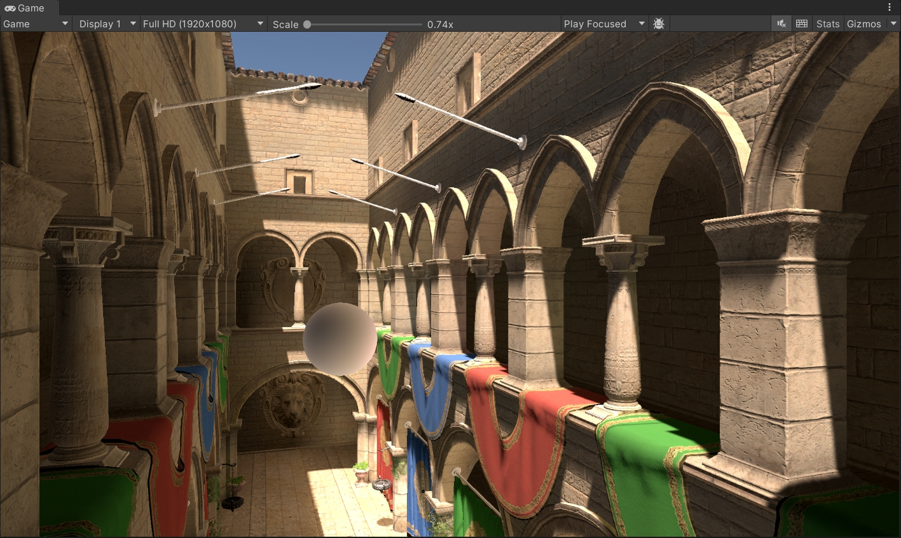

[中文版本 (Chinese Version)](README_CN.md)

# Irradiance Cache

A Light Probe storage and GPU query system based on octree and uniform grid, for Unity Built-in Render Pipeline.

## Overview

IrradianceCache provides two Light Probe data storage modes as an alternative to Unity's default tetrahedral interpolation:

- **Octree mode:** Hierarchical sparse storage, BFS-order flat array, GPU traversal from root to leaf
- **Uniform Grid mode:** Single-level uniform grid, O(1) direct indexing, no seam issues

Both modes share the same `OctreeNode` data structure and SH trilinear interpolation logic, with zero runtime branching achieved through separate HLSL files at the shader level.

## Showcase





## Features

- L1 spherical harmonics (4 coefficients × RGB) stored per-vertex, GPU trilinear interpolation
- Half-precision compressed format (`OctreeNodeCompact`), halving memory usage
- Multi-Volume support: priority sorting + boundary blending
- Directional weighted sampling / SDF-enhanced sampling
- Volume rotation support (`worldToLocal` + `rotationMatrix`)
- Shader Graph compatible (via Custom Function node)
- Editor visualization tools: node structure, SH colors, sampling debug

## Data Structures

### Octree Mode

Octree nodes stored in BFS order in a flat array. Each non-leaf node's `childStartIndex` points to the start of its 8 contiguous child nodes; leaf nodes are marked as -1.

```
Root (index 0)
├── childStartIndex → 1
│   ├── [1] child0  ├── [2] child1  ... ├── [8] child7
│   │   └── childStartIndex → 9 (next level, 8 child nodes)
│   ...
```

Query complexity: O(maxDepth), one comparison per level to determine child octant.

### Uniform Grid Mode

All nodes at the same level, arranged in row-major linear order:

```
linearIndex = iz * (nx * ny) + iy * nx + ix
```

Query complexity: O(1), cell index computed directly from normalized coordinates.

## GPU Architecture

Octree and Grid use separate HLSL files, with the path determined at compile time — no runtime branching:

```
LightProbeTypes.hlsl          ← Shared: structs, buffer access, SH utilities
├── IrradianceCache.hlsl     ← Octree query + sampling (single Volume)
│   └── IrradianceCacheMulti.hlsl
│       └── IrradianceCacheFunctions.hlsl  ← Shader Graph entry
├── UniformGridLightProbe.hlsl ← Grid query + sampling (single Volume)
│   └── UniformGridLightProbeMulti.hlsl
│       └── UniformGridLightProbeFunctions.hlsl
```

Switching in shader:

```hlsl
// Octree
#include "IrradianceCacheFunctions.hlsl"
SampleIrradianceCache_float(...)

// Uniform Grid
#include "UniformGridLightProbeFunctions.hlsl"
SampleGridLightProbe_float(...)
```

## Mode Comparison

| Feature | Octree | Uniform Grid |
|---|---|---|
| Memory | Saves in sparse regions | Fixed nx×ny×nz |
| Query | O(depth) tree traversal | O(1) direct indexing |
| Seams | Requires transition blending | None |
| Best for | Non-uniform density scenes | Uniform density / performance-first |

## Project Structure

```
Assets/IrradianceCache/
├── Runtime/          C# runtime (data structures, building, GPU upload, sampling)
├── Editor/           Inspector, Bake tools, visualization window
├── Shaders/          HLSL query & interpolation, Shader Graph entry, visualization shaders
├── Materials/        Visualization materials
└── Scenes/           Sample scene (Sponza)
```

## Usage

1. Add `IrradianceCache` component to the scene, set bounds and parameters
2. Select storage mode (Octree / UniformGrid) in the Inspector
3. Click Bake to generate `IrradianceCacheData` asset
4. Include the corresponding HLSL file in your material, or connect via Shader Graph Custom Function node

## Requirements

- Unity 2022.3+ (Built-in Render Pipeline)
- Shader Model 4.5+
